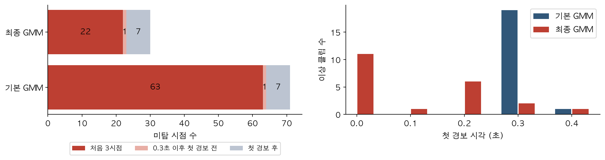

# KAMP AI 유압펌프 조기 이상탐지

파인블랭킹 프레스 유압펌프의 **상부 진동·하부 진동·전류**를 이용해, 클립이 끝나기 전 **0.1초마다 이상 여부를 판단**합니다. 정상 운전 데이터로 학습한 **GMM과 초기 관측 주변분포 판정**을 최종 모델로 사용합니다.

**최종 제출 설정은 W=3, seed 0·1·2입니다.** `main`에는 보고서·발표자료·코드·저장 모델·예측결과를 같은 설정으로 맞춘 최종본을 담았습니다.


## 모델을 개선한 과정

1. 같은 W=3 평가 조건에서 기본 GMM을 포함한 17개 이상탐지 방법을 비교했습니다. 기본 GMM이 가장 높은 시점 F1을 보였습니다.
2. 오류를 분석하니 기본 GMM의 미탐 70~72개 중 **63개가 클립 처음 세 시점의 입력 부족**에서 발생했습니다.
3. 이미 관측된 차원만으로 계산하는 **같은 GMM의 주변분포**를 적용해 첫 관측부터 판정하도록 보완했습니다.
4. 초기 미탐과 첫 경보 지연을 줄였습니다. 시점 오탐은 평균 11.3개에서 11.7개로 소폭 증가했고, 경보한 정상 클립 수는 평균 1.3개로 같았습니다.



## 최종 결과

정상 테스트 120클립과 이상 21클립의 **전체 4,690시점**을 평가했습니다. 시드 0·1·2의 평균이며 ±는 표본 표준편차입니다.

| 지표 | 기본 GMM W=3 | 최종 GMM W=3 |
|---|---:|---:|
| 시점 F1 | 0.9278 ± 0.0014 | **0.9650 ± 0.0013** |
| 시점 미탐률 | 11.83% | **4.94%** |
| 시점 오경보율 | 0.277% | 0.285% |
| 미탐 시점 수 | 71.0 | **29.7** |
| 오탐 시점 수 | 11.3 | 11.7 |
| 0.5초 이내 첫 경보 | 20 / 21클립 | **21 / 21클립** |
| 평균 첫 경보 시각 | 0.305초¹ | **0.108초²** |
| 경보한 정상 클립 | 평균 1.3 / 120 | 평균 1.3 / 120 |

¹ 기본 모델은 미경보 1클립을 제외한 20클립 기준입니다. ² 최종 모델은 이상 21클립 전체 기준입니다. 시간의 기준은 **클립 시작**이며 실제 장치의 통신·추론 지연은 포함하지 않습니다.

[시드별 정확한 결과](KAMP_source/results/metrics_by_seed.csv) · [평균과 표준편차](KAMP_source/results/summary.csv) · [시드 0의 제출 예측결과](KAMP_source/predictions/test_predictions.csv)

## 판정 구조

- 정상 데이터의 시간순 분할: 학습 305 / 검증 54 / 임계값 보정 120 / 테스트 120클립. 이상 21클립은 테스트에만 사용합니다.
- W=3은 **과거 3시점 + 현재 1시점**입니다. 세 센서를 펼친 12차원 입력을 사용합니다.
- 정상 학습 BIC로 혼합 성분 수를 선택합니다. 최종 세 시드 모두 **K=4, full covariance**입니다.
- 처음 1·2·3개 관측은 **3·6·9차원 주변분포**, 이후는 최근 4개 관측의 **12차원 전체분포**로 계산합니다.
- 점수는 음의 로그 밀도입니다. 정상 보정 점수의 **99백분위 임계값**을 넘으면 해당 시점을 이상으로 판단합니다.
- 미래값·클립 경계를 넘는 값·경보 유지·point adjustment는 사용하지 않습니다. 모든 테스트 시점을 평가에 포함합니다.

## 실행

Python 3.12, CPU 환경을 기준으로 합니다. 저장된 시드 0 모델로 테스트 예측과 평가를 재현합니다.

```bash
git clone https://github.com/joonookwak/KAMP_ai.git
cd KAMP_ai/KAMP_source
python -m venv .venv
source .venv/bin/activate
python -m pip install -r requirements.txt
python predict.py
python evaluate.py --predictions runs/test_predictions.csv
```

전처리부터 시드 0·1·2 학습·보정·평가까지 다시 실행하려면:

```bash
python code/final_model_pipeline.py --data-dir data --output-dir runs/final_model
```

전체 실험의 실행 방법과 데이터·모델·예측 파일 설명은 [코드 README](KAMP_source/README.md)에 있습니다. 베이스라인 코드는 [comparisons/baselines](KAMP_source/comparisons/baselines/)에 모았습니다.

## 자료 위치

```text
submission/                       최종 보고서·발표자료·소스코드 ZIP
KAMP_source/
  code/final_model_pipeline.py     전체 최종 파이프라인
  src/                            GMM 학습·주변분포·온라인 판정
  models/                         시드 0·1·2 모델·정규화·임계값
  data/                           원본 및 학습·보정·테스트 분할
  predictions/                    모든 테스트 시점의 예측결과
  results/                        성능 집계·오탐/미탐 진단
  comparisons/baselines/          17개 방법의 통합 비교
  comparisons/report_results/    W=3 센서 제거·전류 통제 실험
  comparisons/history_W2/        이전 W=2 결과
  comparisons/improvements/      W=2 개선 후보 개발 이력
docs/figures/                     README의 실험 그림
```

## 결과의 해석 범위

W=3은 기존 W 비교 결과를 참고해 선택한 **탐색적 최종 설정**입니다. 독립 현장 검증은 향후 수행해야 합니다. 이상 21클립은 하나의 이상 기록에서 나왔으며, 독립적인 21개 고장 사례가 아닙니다. 파일 상태 라벨을 시점 평가에 사용하므로 정확한 물리적 고장 시작 시각은 알 수 없습니다.

전류 양자화와 절대 레벨을 통제한 추가 실험을 포함했지만, 정상·이상 수집 날짜와 운전 조건의 교란을 완전히 배제하지는 못했습니다. 본 모델은 **작업자의 점검 판단을 지원하는 조기 경보 모델**이며 자동 정지 제어의 현장 검증은 별도입니다.

이전 공유 자료는 [전류 센서 검토 브랜치](https://github.com/joonookwak/KAMP_ai/tree/analysis/gmm-current-audit)와 [오탐·미탐 개선 브랜치](https://github.com/joonookwak/KAMP_ai/tree/analysis/gmm-error-improvement)에 보존되어 있습니다. 최종 제출 기준은 이 `main` 브랜치의 W=3 자료입니다.
