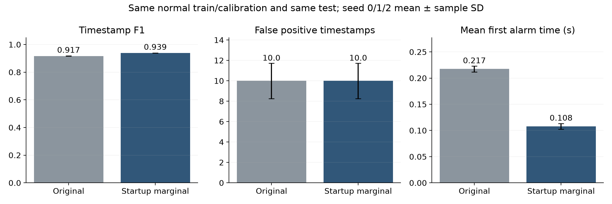

# KAMP 유압펌프 조기 이상탐지: 오류 분석과 개선 실험 최종 정리

작성일: 2026-10-08. 본문만으로 보고서·발표의 문제 정의, 데이터, 방법, 평가, 결과, 한계를 설명할 수 있도록 정리했다. 그림은 보조 자료이며 모든 핵심 수치는 본문에 적었다.

## 1. 핵심 요약 — 발표의 중심 메시지

**최종 권고: 원래 3센서 GMM을 유지하고, 처음 두 시점에만 관측 가능한 차원의 주변분포로 판정하는 ‘초기 주변분포 GMM’을 적용한다. 경보는 기본적으로 시점별 판정을 사용한다.**

- 원래 모델의 오탐은 정상120클립 중 같은 두 클립에 집중됐다. 시점 미탐의 약 절반은 처음2시점에서 점수를 계산하지 않은 데서 발생했다.
- 개선 후보8개 × 경보 정책4개 × seed0/1/2, 총96실행을 비교했다. 모델 학습·점수 보정·임계값 설정에는 정상 데이터만 사용했다.
- 오탐 수와 정상 경보 클립 수를 늘리지 않고 모든 이상클립의0.5초 경보를 유지하는 후보 중 F1이 가장 높은 방법을 권고했다.
- **F1: 0.9172 ± 0.0003 → 0.9388 ± 0.0003.** 절대0.0217 증가.
- **평균 첫 경보 시간: 0.2175 ± 0.0055초 → 0.1079 ± 0.0055초.** 평균약0.110초,약50.4% 단축.
- **오탐: 평균10시점으로 동일. 미탐: 평균83.33→60.33시점,23시점 감소.** 초기2시점의42개 미판정 중 평균23개를 추가로 잡았다. 나머지 초기시점의 미탐은 여전히 남는다.
- 세시드 모두 이상21/21클립을0.5초 안에 경보했다. 정상 경보 클립은2/120으로 동일하다.

**이 결론은 같은 테스트의 오류 분석 후 후보를 비교한 탐색적 개발 결과다. 독립 현장 검증 결과가 아니다.**

## 2. 산업 현장과 문제 정의

파인블랭킹 프레스의 유압펌프 이상은 압력 불안정, 가공품 불량, 설비 비가동으로 이어질 수 있다. 주기점검과 경험 기반 판단을 보완하려면 관측 초반에 이상을 알리면서 정상 운전 변화를 고장으로 오인하는 경보도 줄여야 한다.

과제는 상부·하부 진동과 모터 전류 시계열을 이용한 이상 조기탐지 및 오경보·미탐 조건 분석이다. 본 연구의 질문은 다음과 같다.

> 정상 데이터로 학습한 GMM이 관측 초반에 이상을 탐지할 수 있는가? 남은 오류는 어떤 센서 패턴에서 발생하며, 오경보를 늘리지 않고 초기 미탐을 줄일 수 있는가?

본 데이터는 이미 이상 라벨이 부여된 기록을 관측하는 문제다. **미래 고장 발생 예측, RUL 추정, 실제 고장 시작 후 지연, 자동 프레스 정지의 안전성**을 검증한 실험은 아니다. 현장에서는 점검 요청·경고의 판단 보조로 연결하고 정지 여부는 설비 안전 절차와 별도로 정해야 한다.

## 3. 데이터 구성과 분할

| 항목 | 내용 |
|---|---|
| 센서 | AI0_Vibration 상부진동, AI1_Vibration 하부진동, AI2_Current 전류 |
| 시간 구조 | 클립 내부 CSV 간격0.1초.0.5초 초과 기록 공백으로 클립 분리 |
| 정상 기록 | 원본20,000행, 동일타임스탬프 중복1행 제거 →19,999행,599클립 |
| 이상 기록 | 600행,21클립. 하나의 원본 이상 기록에서 나눈 구간 |
| 정상 분할 | 시간순 학습305 / 검증54 / 보정120 / 테스트120클립 |
| 테스트 | 정상4,090시점 + 이상600시점 =4,690시점 |
| 라벨 | 클립 상태를 각 시점에 적용. 각 시점에 물리적 이상 신호가 드러났다는 세밀한 정답은 없음 |

모든 후보는 같은 정상·이상 테스트를 사용했다. ‘정상 학습 범위 확대’만 정상 검증54클립을 학습에 합쳐359클립을 사용했으며, 이 차이를 숨기지 않았다. 테스트 클립은 학습에 넣지 않았다.

클립이 프레스1회 작동을 정확히 뜻하는지는 제공 메타데이터로 확정하지 않았다. 본문에서는 기록 구간을 뜻하는‘클립’이라고 부른다. 센서 물리 단위가 확인되지 않은 값에 임의 단위를 붙이지 않았다.

## 4. 기존 GMM과 원래 평가 절차

### 4.1 정상 분포 학습

정상 학습 관측만으로 각 센서의 평균·표준편차를 구해 표준화한다. 과거2시점과 현재시점의3센서를 묶은9차원 벡터를 입력한다.

`z_t = [진동0, 진동1, 전류]_(t−2), [진동0, 진동1, 전류]_(t−1), [진동0, 진동1, 전류]_t`

GMM은 몇 개의 가우시안 분포를 섞어 정상 운전 패턴을 표현한다.

`p(z) = Σ_k π_k N(z; μ_k, Σ_k)`

학습에는 정상만 사용한다. K=1·2·4 후보 중 정상 학습 BIC가 최소인 모델을 선택한다. full covariance, reg_covar=1e−4, n_init=2, max_iter=200, seed0/1/2를 사용한다. 이상 점수는 `s_t = −log p(z_t)`이며 높을수록 정상 분포에서 드물다.

### 4.2 임계값과 시점별 판정

정상 보정120클립의 점수99백분위를 임계값으로 정하고 `s_t > threshold`이면True로 판정한다. 이상 테스트 라벨로 임계값을 맞추지 않는다. 과거·현재만 사용하며 클립 사이로 윈도우를 연결하지 않는다.

기존 모델은 처음2시점(0.0·0.1초)에 점수가 없어False를 출력했다. 최초 판단은0.2초부터다. 이 미판정도 전체 시점 F1에서FN으로 포함했다.

## 5. 원래 모델의 오류 분석

| seed | 오탐 FP | 전체 미탐 FN | 초반 관측 부족 | 첫 경보 전 판정 미탐 | 첫 경보 이후 미탐 |
|---|---:|---:|---:|---:|---:|
| 0 |12|82|42|5|35|
| 1 |9|84|42|3|39|
| 2 |9|84|42|3|39|

### 5.1 오탐은 두 정상 클립에 집중

- `normal_0570`: seed0에서10FP, seed1/2에서8FP. 드문 상부진동 패턴과 다른 센서와의 조합이 두드러졌다. seed0의FP10점 모두 상부진동 조건부 점수가 정상 보정99백분위보다 높았다. 전류 조건부 점수는 이10점 모두99백분위 미만이었다.
- `normal_0576`: seed0에서2FP, seed1/2에서1FP. 전류값261.15·258.72의 관측을 포함한 드문 윈도우가 나타났다. 전류 조건부 점수는 정상 보정약99.6백분위였다.
- 세시드 공통FP9점, 어느 시드라도FP인 시점12점. 초기화를 바꿔도 대부분 같은 오류다.

여기서 조건부 점수는 학습 GMM의 `−log p(한 센서3시점 | 나머지 두 센서3시점)`을 정상 보정 분포 백분위로 바꾼 진단 지표다. 물리적 고장 원인의 인과 기여도는 아니다. FP의 실제 원인이 드문 정상 운전인지 수집 조건 변화인지 확인하려면 운전·정비 기록이 필요하다.

### 5.2 미탐은 정상과 겹치는 짧은 패턴에서 발생

seed0의 점수 계산 가능한FN40점과TP518점을 비교했다.

| 특징 중앙값 | FN | TP |
|---|---:|---:|
| 최근3시점 상부진동 최대절댓값 |0.069|0.205|
| 최근3시점 하부진동 최대절댓값 |0.087|0.199|
| 현재 전류1시점 변화절댓값 |27.42|57.22|
| 최근3시점 전류 최대절댓값 |135.90|141.86|
| 최근접 정상학습 윈도우 거리 |0.924|2.302|

미탐 구간은 진동이 작고 전류 변화도 상대적으로 완만하며 정상 학습 패턴에 더 가깝다. 전류의 절대 크기만으로TP/FN을 구분하기는 어렵다. 거리는 정상 학습 표준화9차원의Euclidean거리다.

- `fault_0004`: seed0에서0.2~0.4초를 놓쳐 첫 경보0.5초. 초기 지연의 대표 사례.
- `fault_0021`: 진동이 작고0.2초 점수가 임계값 아래에 있다가0.3초 첫 경보. 이후 조용한 시점에False가 다시 발생.
- 세시드 모두 이상21클립에0.5초 내 경보. **시점 미탐과 클립 전체 경보 실패는 다르다.**

## 6. 개선 실험 설계

총8개 점수/입력 후보를 각각4개 경보 정책과 결합해3시드로 비교했다. 기준 모델도 포함하므로96실행이다. 학습 범위 확대·군집 수 확대는 새로 정상 학습했고 나머지는 저장된 모델을 활용했다.

### 6.1 점수·입력 후보 8개

1. **기존 GMM:** 원래9차원 점수.
2. **전류 조건부 점수:** 정상 GMM에서 진동을 조건으로 한 전류의 희귀성. 전류만 쓰는 모델과 다르다.
3. **전체+조건부 결합:** 정상 검증 점수의 중앙값/IQR로 두 점수를 표준화하고 작은 값을 사용. 두 관점에서 모두 드문 경우를 강조한다. 보정99백분위로 새 임계값을 정한다.
4. **정상 군집 수 확대:** K=1·2·4·8·16 중 정상 학습BIC 선택. 복잡한 정상 패턴의 표현력 개선 후보.
5. **정상 학습 범위 확대:** 기존 학습305+검증54클립으로 정상 범위를 확대. K=1·2·4BIC. 보정·테스트는 유지.
6. **초기 주변분포 GMM:** 기존 모델에 처음1·2시점의 주변분포 판정을 추가.
7. **초기 조건부 GMM:** 전류 조건부 점수에도 처음1·2시점 판정 추가.
8. **초기 결합 GMM:** 결합 점수에도 처음1·2시점 판정 추가.

각 점수는 정상 보정99백분위로 임계값을 정했다. 초기 판정은 같은 초기 위치의 정상 보정 관측만으로 임계값을 정했다. 현재 시점의 센서 크기 외에도 변수 관계를 보지만, 정상/이상 수집 조건의 차이가 성능에 기여할 가능성은 남는다.

### 6.2 경보 정책 4개

- **시점별:** 현재 점수만 임계값과 비교.
- **2회/3회 연속:** 연속 초과를 확인한 현재시점부터True. 과거시점을소급수정하지 않는다.
- **히스테리시스:** 정상 보정99백분위 초과로 경보 시작.95백분위 이하 점수가2회 연속 나오면 해제. 각클립 시작에서 상태를 초기화한다.

히스테리시스 결과는 **기억을 사용하는 경보 상태**의 평가다. 순간 센서 점수 자체가 개선된 것으로 해석하지 않는다. 실제 정상 복귀시점 정답이 없으므로 해제 정책의 물리적 타당성도 별도 검증이 필요하다.

### 6.3 최종 후보 선택 기준

1. 세시드 모두21/21이상클립의0.5초 내 첫 경보 유지.
2. 평균FP가 기존10시점을 넘지 않음.
3. 각시드의 경보한 정상 클립 수가 기존2개를 넘지 않음.
4. 위 조건을 만족하는 후보 중 평균 시점F1최대.

이는 이번 탐색 비교의 선택 기준이다. 기존 테스트 오류에서 후보를 구상하고 같은 테스트로 최종 후보를 골랐으므로 독립 검증이나 사전 등록 시험처럼 소개하지 않는다.

## 7. 개선 후보 비교 결과

아래는 기억을 쓰지 않는 시점별 정책끼리 비교한 결과다. 고정된 분할에서 seed0/1/2의 평균±표본SD(ddof=1)다. 표의 평균 오탐/미탐 수가 소수인 것은 서로 다른시드의 정수 개수를 평균했기 때문이다.

| 시점 판정 후보 | F1 평균 ± SD | 오탐 시점 평균 | 미탐 시점 평균 | 0.5초 경보율 평균 | 경보한 정상 클립 평균 |
|---|---:|---:|---:|---:|---:|
| 기존 GMM | 0.9172 ± 0.0003 | 10.00 | 83.33 | 100.00% | 2.00 |
| 전류 조건부 점수 | 0.8975 ± 0.0058 | 6.00 | 106.67 | 100.00% | 5.33 |
| 전체+조건부 결합 | 0.9038 ± 0.0070 | 4.33 | 101.67 | 100.00% | 3.67 |
| 정상 군집 수 확대 | 0.9220 ± 0.0014 | 13.00 | 75.67 | 100.00% | 2.33 |
| 정상 학습 범위 확대 | 0.9184 ± 0.0014 | 10.00 | 82.00 | 100.00% | 2.33 |
| 초기 주변분포 GMM | 0.9388 ± 0.0003 | 10.00 | 60.33 | 100.00% | 2.00 |
| 초기 조건부 GMM | 0.9118 ± 0.0062 | 7.00 | 91.33 | 100.00% | 5.33 |
| 초기 결합 GMM | 0.9190 ± 0.0073 | 5.33 | 85.33 | 100.00% | 3.67 |

### 어떤 후보가 왜 선택되지 않았나?

- 조건부·결합 점수는FP시점 수를 줄였지만 시점미탐 및 경보한 정상클립 수가 증가했다. 오류점 수 감소와 경보 영향을 받는 정상클립 수는 다를 수 있다.
- 군집 수 확대는F1을 조금 올렸지만FP가 평균13으로 증가했다.
- 정상 학습 범위 확대는F1변화가 작고 일부시드에서경보한 정상클립이3개로 늘었다. 정상 데이터를 더 넣었다고 모든 희귀 패턴이 해결되지는 않았다.
- 초기 주변분포는0.2초 이후의 모든 점수·임계값·시점판정을 보존하면서 초기 판정만 보완했다. **테스트 정상 초반에서 추가FP가0개여서기존오경보를늘리지 않았다.**



## 8. 최종 권고 방법 — 초기 주변분포 GMM

### 8.1 핵심 아이디어

기존 모델이 처음 두 시점에 무조건 False를 내는 문제를 보완한다. 아직 관측하지 않은 미래값을 추정하거나 채우는 대신, **관측한 변수만의 GMM 주변분포로 점수를 계산한다.**

기존9차원GMM의혼합가중치·평균·공분산을그대로쓴다. 현재관측가능차원집합을O라하면:

`p(z_O) = Σ_k π_k N(z_O; μ_(k,O), Σ_(k,O,O))`

가우시안의 주변분포는 해당 차원의 평균과 공분산 부분행렬로 계산할 수 있으므로, 초기 판정용 모델을 별도로 학습할 필요가 없다.

| 클립 내 위치 | 관측 정보 | 점수 차원 | 임계값 |
|---|---|---:|---|
| index0, elapsed0.0초 | 현재3센서1시점 |3| 정상 보정클립의index0점수99백분위 |
| index1, elapsed0.1초 | 현재까지3센서2시점 |6| 정상 보정클립의index1점수99백분위 |
| index≥2, elapsed≥0.2초 | 최근3시점 |9| 기존 정상보정W=2점수99백분위 |

3·6·9차원 우도는 서로 스케일이 다르므로 하나의 임계값을 공유하지 않는다. 초반 위치별 보정으로 정상 클립 시작의 분포도 반영한다. 운영에서는 시점별 점수·임계값·현재 차원수를 함께 기록한다.

**0.0초는 클립의 첫 센서값을 이미 받은 시점**이다. 센서 측정 전 탐지나 0초의 컴퓨팅 지연을 뜻하지 않는다. 실제 연산·통신 지연은 이번에 측정하지 않았다.

### 8.2 기존 대비 정량적 개선

| 지표 | 기존 GMM | 초기 주변분포 GMM |
|---|---:|---:|
| 시점F1 |0.9172 ± 0.0003|0.9388 ± 0.0003|
| 시점 오탐률 |0.244 ± 0.042 %|0.244 ± 0.042 %|
| 시점 미탐률 |13.889 ± 0.192 %|10.056 ± 0.192 %|
| 평균FP수 |10.00 ± 1.73|10.00 ± 1.73|
| 평균FN수 |83.33 ± 1.15|60.33 ± 1.15|
| 평균 첫 경보 시간 |0.2175 ± 0.0055초|0.1079 ± 0.0055초|
| 첫 경보 시간p90 |0.300초|0.300초|
| 첫 관측시점 경보율 |0%|52.38% (11/21)|
| 0.2초 내 경보율 |85.71% (18/21)|85.71% (18/21)|
| 0.5초 내 경보율 |100% (21/21)|100% (21/21)|
| 경보한 정상 클립 |2/120|2/120|

퍼센트 지표의 ±값은 퍼센트포인트 SD다. 평균 지연은 개선됐지만 **p90과 0.2초 경보율은 같다.** 모든클립에서더빨라졌거나가장늦은사례까지해결했다고말하지않는다. 초기판정이기존보다늦게만들지는않았지만추가정보가도움되지않은클립은남았다.

기존미판정42개중평균23개를추가탐지해전체FN을23개줄였다. 첫두시점의남은FN은새모델에서‘점수가없는미판정’이아니라‘주변분포점수가임계값이하인판정미탐’으로바뀐다.0.2초이후원래FN/FP는이방법으로해결되지않는다.

### 8.3 정책을 함께 바꾸면?

| 초기 주변분포 GMM의 경보 정책 | F1 평균 ± SD | 오탐 시점 평균 | 0.5초 경보율 평균 | 평균 첫 경보 시간 |
|---|---:|---:|---:|---:|
| 시점별 판정 — 최종 권고 | 0.9388 ± 0.0003 | 10.00 | 100.00% | 0.108초 |
| 2회 연속 초과 | 0.8934 ± 0.0026 | 5.67 | 95.24% | 0.214초 |
| 3회 연속 초과 | 0.8500 ± 0.0051 | 3.00 | 85.71% | 0.343초 |
| 히스테리시스 — 운영 선택지 | 0.9618 ± 0.0033 | 15.67 | 100.00% | 0.108초 |

**주 모델 권고는 시점별 정책이다.** 히스테리시스는 F1이 약 0.962로 가장 높지만 FP가 10→15.67로 약 56.7% 늘었다. 같은 두 정상 클립 안에서 경보가 더 오래 유지된 영향이다. 초기 주변분포의 모델 개선과 히스테리시스의 상태 유지를 구분해서 설명한다.

2회연속확인은FP를줄였지만0.5초경보율이95.24%로낮아졌고3회연속은85.71%였다. 공모전의조기경보목표에서단순연속확인을주방법으로채택할근거가약하다.

현장점검알림이깜빡이지않게유지해야하는요구가있다면히스테리시스를별도운영옵션으로둘수있다. 시점별모델판정과설비알림상태를동시에로그로남긴다. **오탐을줄이는정책이라고소개하지않는다.**

## 9. 평가지표와 공정성

- TP/FP/FN/TN은전체4,690타임스탬프에서계산한다. 클립전체를한번맞히면모든시점을맞힌것으로바꾸는point adjustment는하지않았다.
- F1=`2TP/(2TP+FP+FN)`; 오탐률=`FP/(FP+TN)`; 미탐률=`FN/(TP+FN)`.
- 첫경보는클립시작부터첫True까지의elapsed시간.0.5초경보율은전체이상21클립이분모이며무경보도실패다.
- 시점오탐수와경보한정상클립수둘다본다. 한클립에연속오탐이많은경우와여러클립에한점씩오탐이퍼지는경우가다르다.
- 같은정상보정99백분위를사용해도3시점·초반위치·정책별경보예산이완전히같지는않다. 실제테스트오탐과정상클립경보수를함께보고선택했다.
- baseline과초기주변분포는최초판정가능시점이달라서관측부족문제를직접개선한비교다.0.2초이후모든점수·판정이동일함을검증해후반부모델이더좋아진것으로포장하지않았다.
- 미래관측미사용·과거판정소급변경없음·클립간상태초기화를코드와prefix일치검사로확인했다.96실행의혼동행렬과FN분해도저장판정에서재검증했다.

## 10. 남은 한계와 적용 계획

### 아직 해결하지 못한 것

1. 정상두클립의드문진동/전류조합에서나온오탐은그대로남았다. 이번후보중조기경보를유지하면서이오탐까지안정적으로줄이는방안은찾지못했다.
2. 진동이작고전류변화가완만한시점은정상분포와겹쳐미탐이남는다. 사이클상태라벨만으로각시점이실제로이상신호를담는지알수없다.
3. 정상/이상수집날짜와전류기록조건차이의영향은해소되지않았다. 전류단독높은성능을누수증명으로보지는않지만고장정보만의성능으로확정할수도없다.
4. 이상21클립은한기록의구간이다. seed3회SD는독립고장/현장일반화의신뢰구간이아니다.
5. 같은테스트오류를분석한뒤후보를선택한개발결과다. 새로운동일계측조건정상·이상기록으로최종후보를검증해야한다.

### 현실적인 적용 구조

센서수신 → 표준화 → 관측수에따른3/6/9차원GMM점수 → 해당임계값으로시점판정 → 점검경고 → 전문가확인·정비기록. 새클립에서는관측버퍼와경보상태를초기화한다.

실제스트리밍에클립시작신호가없다면공백검출/장비사이클신호로초기화할기준이필요하다. 정상부하변화·점검후상태·센서교체를포함한새정상기록으로보정안정성을확인한다. 희귀한정상패턴을테스트에서빼거나라벨을바꾸지않는다.

추가벤치마크(UCI유압설비)에서기존GMM의우위는확인되지않았다. 따라서이결론을범용GMM우수성으로확장하지않고**현재KAMP의초기관측공백을보완한효과**로설명한다.

## 11. 보고서·PPT 구성안과 그대로 쓸 결론

### 발표 순서

1. **산업문제:** 펌프이상에따른압력/품질/비가동위험,빠른점검경고와오경보관리.
2. **방법배경:** 예측·재구축·밀도/거리방법의차이. 우리방법은정상밀도를학습하는GMM. 모든데이터에최고라고주장하지않음.
3. **데이터/EDA:** 3센서,클립구성,정상학습분할,라벨의해상도와수집조건한계.
4. **기존방법:** 9차원GMM,BIC선택,정상보정99백분위,시점별평가.
5. **오류발견:** 전체미탐의절반이초반미판정. 나머지는대부분첫경보이후. 오탐은두클립의희귀패턴.
6. **개선방법:** 관측1/2/3시점에3/6/9차원주변분포,정상초기위치별임계값. 수식과한클립시간축으로설명.
7. **실험:** baseline→개선의F1/오탐/첫경보시간,8후보비교,연속경보·히스테리시스trade-off.
8. **적용/한계:** 점검보조구조,해결되지않은오류,독립기록검증계획.

### 발표용 핵심 결론

> 정상 데이터로 학습한 GMM은 모든 이상 클립에 0.5초 안에 경보했지만, 초반 두 시점은 관측 부족으로 판정하지 못했습니다. 오류 분석을 바탕으로 관측한 센서만의 주변분포를 사용하는 초기 판정을 추가했습니다. 같은 테스트에서 오탐 수와 정상 경보 클립 수를 늘리지 않으면서 F1은 0.9172에서 0.9388로, 평균 첫 경보 시간은 0.217초에서 0.108초로 개선됐습니다. 다만 p90과 0.2초 경보율은 변하지 않았고, 드문 정상 패턴의 오탐과 일부 시점 미탐은 남아 있습니다. 본 결과는 탐색적 개발 결과이며 독립 현장 기록 검증이 필요합니다.

### 예상 질문

- **“초반에도판정하면오경보가늘지않나요?”** 정상보정클립의같은초기위치에서임계값을별도로정했다. 이번정상테스트에서추가FP는0이었지만새기록에서보장되지는않는다.
- **“미래값을예측해채우나요?”** 아니다. 가우시안혼합의주변분포로관측한차원만평가한다.
- **“왜F1최고0.962를안쓰나요?”** 경보유지가들어간정책이며FP가증가했다. 조기탐지·오경보억제목표를함께고려해시점별0.9388을권고했다.
- **“미탐이모두해결됐나요?”** 아니다. 초기42개중평균23개를추가탐지했고0.2초이후의미탐은그대로다.
- **“왜GMM을썼나요?”** 현재데이터에서기존방법비교와정상분포/변수관계해석이가능했기때문이다. 외부데이터에서항상최고라는주장은하지않는다.

## 12. 자료와 재현

- 원본출처: KAMP ‘소성가공예지보전AI데이터셋’의 `press_data_normal.csv`, `outlier_data.csv`. 원본SHA256은 `results/analysis.json`에보존.
- `code/analyze.py`: 원래저장모델의오류진단. 저장점수와재계산점수일치확인.
- `code/recommended_detector.py`: 센서값을 한 시점씩 받아 3/6/9차원으로 판정하는 실행 가능한 최종 모델. 각 클립 시작에서 reset한다. 모델·표준화·임계값은 `results/improvements/recommended/`에 seed별로 보존했다. 총14,070개 시점 판정이 비교 실험과 일치함을 확인했다.
- `code/improve.py`: 정상학습/보정기반96실행. 후보/정책정의는 `results/improvements/protocol.json`.
- `results/improvements/runs.csv`, `summary.csv`: 실행별결과,평균/표본SD.
- `results/improvements/selection.json`: 선택기준과권고후보. 테스트를사용한최종후보선택임을명시.
- `results/improvements/predictions_96_runs.zip` 안의 `*_predictions.csv`: 클립ID·시점·점수·임계값·판정·라벨. 원시센서값없음.
- `results/improvements/model_fits.json`: 정상학습BIC·군집수선택.
- `figures/`: FP/FN클립6개,미탐분해,조건부희귀도,개선요약.
- 원래오류CSV에는원시센서값이있으므로로컬분석자료로보존하고Git자동업로드하지않았다.

재현환경: Python3.12, NumPy2.5.3, pandas2.2.3, scikit-learn1.9.1, SciPy/joblib/matplotlib. 원래저장된9차원모델·표준화설정·판정CSV가필요하다. 처음부터학습하는재현과구별한다.

```bash
python code/analyze.py --experiment-root /path/to/press_forecast_experiment --code-dir /path/to/team_shared/gmm_audit/code --data-dir /path/to/original_csv_folder
python code/build_report.py
python code/improve.py --experiment-root /path/to/press_forecast_experiment --code-dir /path/to/team_shared/gmm_audit/code --data-dir /path/to/original_csv_folder
python code/finalize_report.py
```

보고서의 수치는 저장된 판정에서 검증했다. 모델 학습과 임계값 계산에는 테스트 클립을 넣지 않았다. 그러나 **후보 구상과 권고 후보 선택에서 테스트를 참고했으므로 최종 숫자는 독립 검증이 아니다.** 이 문장을 수치와 함께 유지한다.
